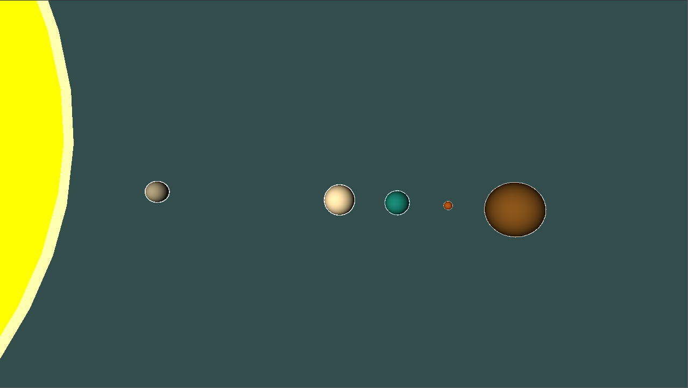
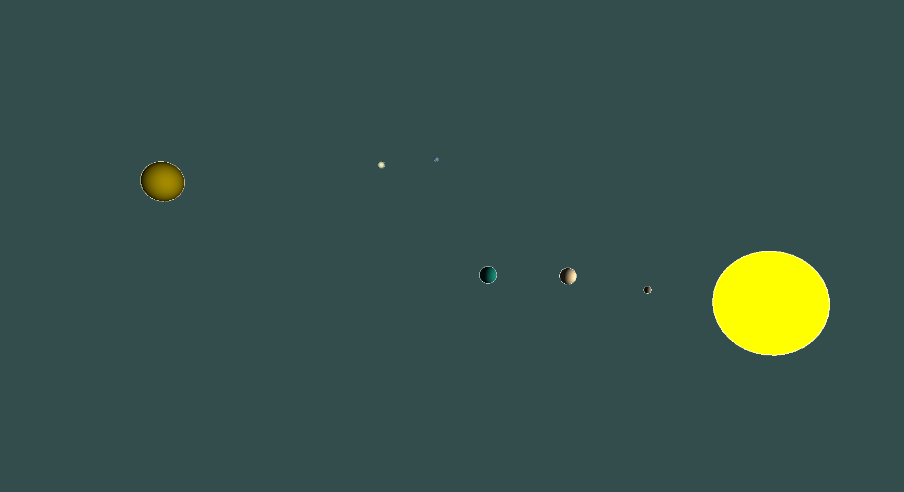
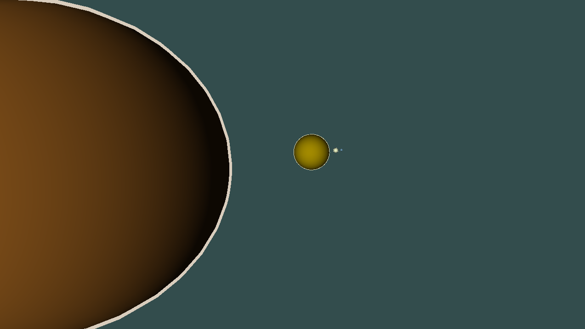

# OpenGL Sonnensystem

## Building

Auf Linux mit der bereitgestellten `build.sh`:

```
git clone ttps://github.com/devjosh8/opengl-sonnensystem
./build.sh
```

oder auf Windows:

```
git clone ttps://github.com/devjosh8/opengl-sonnensystem
mkdir build
cd build
cmake ..
make
```

## Steuerung

- WASD - Bewegen
- Leertaste - hoch
- Shift - runter
- Steuerung - schneller Bewegen

## Informationen

Die Größe der Sonne entspricht nicht der Realität, da diese sonst noch etwa 10 mal so groß wäre wie Jupiter.

Verhältnis der Abstände der Planeten und Verhältnis der Größen der Planeten entsprechen der Realität.

## Screenshots









